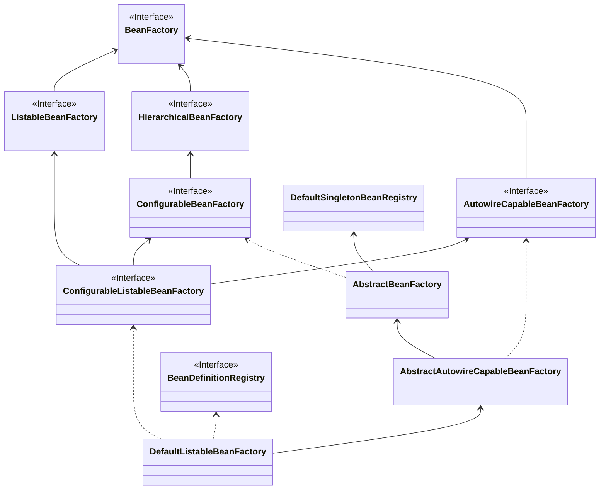

# bean的生命周期 

先给出比较重要的三个

|            | init-method & destroy-method              | @PostConstruct & @PreDestroy    | InitializingBean & DisposableBean |
| ---------- | ----------------------------------------- | ------------------------------- | --------------------------------- |
| 执行顺序   | 最后                                      | 最先                            | 中间                              |
| 组件耦合度 | 无侵入（只在 `<bean>` 和 `@Bean` 中使用） | 与 JSR 规范耦合                 | 与 SpringFramework 耦合           |
| 容器支持   | xml 、注解原生支持                        | 注解原生支持，xml需开启注解驱动 | xml 、注解原生支持                |
| 单实例Bean | √                                         | √                               | √                                 |
| 原型Bean   | 只支持 init-method                        | √                               | √                                 |

# # IOC容器的一些重要类

## BeanFactory的子接口

这是ioc的基础容器，也spring ioc最顶层的类。其下的子接口和类都是为了实现某些额外的特性（层次性，可搜索性，可配置性）

**主要的特性：**

- 基础容器
- 定义了作用域的概念
- 集成环境配置
- 支持多种类的的配置源
- 层次性的设计
- 完整的生命周期控制机制

### HierarchicalBeanFactory【熟悉】 

这个就是实现**层次性**的BeanFactory。

### ListableBeanFactory 【熟悉】

 这个就是实现**可迭代**的特性，即可以查找到容器中的所有bean

**特性：**

- ListableBeanFactory可以列举中容器的前部bean
- ListableBeanFactory只例举当前容器的bean
- 选择性列举：容器中不是所有的bean都能拿到，比如下面的就拿不到
  - `registerSingleton(...)` 手动注册的 Bean  
  - 嵌套 Bean / 抽象 Bean 定义 
  - 父工厂的bean
- ListableBeanFactory 除了getBeanDefinitionCount` 和 `containsBeanDefinition外，其他方法不适合频繁调用

### AutowireCapableBeanFactory【了解】

支持**自动注入**的 BeanFactory

**特点：**

- AutowireCapableBeanFactory可以支持外部Bean的自动装配
- AutowireCapableBeanFactory用于框架集成
- AutowireCapableBeanFactory 不由ApplicationContext实现但可获取：说明了该接口其实一般使用不到
- AutowireCapableBeanFactory可以借助BeanFactoryAware注入

### ConfigurableBeanFactory【熟悉】

从名字来看，这个类具备了 **可配置**的特性

如何理解 **可配置：**

其实就是指设置值，就好比bean会提供set...的方法一样。

**特点：**

- ConfigurableBeanFactory提供可配置的功能，可以进行修改，扩展等。
- ConfigurableBeanFactory不推荐给开发者使用

## BeanFactory的实现类

### AbstractBeanFactory

作为BeanFactory最基础的一个抽象实现，具备了部分功能。

**特点：**

- AbstractBeanFactory作为BeanFactory最终的基础实现：说白了就是BeanFactory下面第一个抽象的实现类
- AbstractBeanFactory对Bean的支持：就是在BeanFactory的基础上扩展了一些另外的功能，比如Bean的别名（`AliasRegistry` 接口），bean定义的的合并（涉及Bean的继承）
- AbstractBeanFactory定义了模板方法：子类要实现的主要模板方法是：getBeanDefinition` 和 `createBean 。比如 DefaultListableBeanFactory` 和 `AbstractAutowireCapableBeanFactory。说白了就是：使用模板方法，父类提供逻辑规范，子类提供具体的实现。

### AbstractAutowireCapableBeanFactory【掌握】

AutowireCapableBeanFactory的具体实现，它可以实现组件的自动装配了。

**特点：**

- 提供Bean的具体实现逻辑
  - 继承了AbstractBeanFactory的抽象类，且实现了createBean()方法，说明具有 **创建Bean**的能力
    - 其实createBean()方法也不是具体实现，而是 doCreateBean()方法，是**protected**方法，子类可以实现。
  - 实现了 AutowireCapableBeanFactory 接口，说明可以 **实现自动注入了**
- AbstractAutowireCapableBeanFactory实现了属性赋值和条件注入：也就是核心功能：**1、Bean的创建 2、属性填充和依赖的自动注入 3、Bean的初始化**这是创建Bean **最核心的三步**
- AbstractAutowireCapableBeanFactory保留了模板方法：AbstractAutowireCapableBeanFactory并没有实现 AbstractAutowireCapableBeanFactory 的全部模板方法，保留了 resolveDependency 方法，这个方法的作用是  **解析Bean的成员中定义的属性依赖关系**
- AbstractAutowireCapableBeanFactory 不负责BeanDefinition的注册：也就是 AbstractAutowireCapableBeanFactory它是不负责 **Bean定义的进入**

### DefaultListableBeanFactory【掌握】

**唯一一个目前使用的BeanFactory落地实现**

**特点：**

- DefaultListableBeanFactory 是BeanFactory的 **最终默认实现**
- DefaultListableBeanFactory会注册Bean的定义信息再创建Bean：DefaultListableBeanFactory实现了 **`BeanDefinitionRegistry`**，它会利用这个接口 **注册Bean定义信息**。所以完整的Bean的管理是 **1、注册Bean的定义信息，2、完成Bean的创建和初始化动作**
- DefaultListableBeanFactory不负责解析Bean定义文件

### XmlBeanFactory【了解】

在 SpringFramework 3.1 之后，`XmlBeanFactory` 正式被标注为**过时**，代替方案是： `DefaultListableBeanFactory + XmlBeanDefinitionReader`  更加符合单一职责

### BeanFactory体系关系图：




[drawio图](./DefaultListableBeanFactory.drawio)

https://c5id4ymctd.feishu.cn/wiki/EC38w0YyeiHj4PkkAvCceFbQnvB

## ApplicationContext

开发中推荐使用  ApplicationContext 而不是BeanFactory，因为ApplicationContext 扩展了很多功能

| Feature                                                      | `BeanFactory` | `ApplicationContext` |
| :----------------------------------------------------------- | :------------ | :------------------- |
| Bean instantiation/wiring —— Bean的实例化和属性注入          | Yes           | Yes                  |
| Integrated lifecycle management —— **生命周期管理**          | No            | Yes                  |
| Automatic `BeanPostProcessor` registration —— **Bean后置处理器的支持** | No            | Yes                  |
| Automatic `BeanFactoryPostProcessor` registration —— **BeanFactory后置处理器的支持** | No            | Yes                  |
| Convenient `MessageSource` access (for internalization) —— **消息转换服务（国际化）** | No            | Yes                  |
| Built-in `ApplicationEvent` publication mechanism —— **事件发布机制（事件驱动）** | No            | Yes                  |

## 1. ApplicationContext和它的上下辈们

**特点：**

- ApplicationContext 是 **中央接口**，最最核心，涉及一个重要概念： **重新加载**

- ApplicationContext组合多个功能接口

  - 继承 `ListableBeanFactory` ：具有访问应用程序组件的 Bean 工厂方法

  - 继承 `ResourceLoader` 接口：以通用方式加载文件资源的能力

  - 继承 `ApplicationEventPublisher` 接口：将事件发布给注册的监听器

  - 继自 `MessageSource` 接口：解析消息的能力，支持国际化

  - 从父上下文继承。在子容器中的定义将始终优先。例如，这意味着整个 Web 应用程序都可以使用单个父上下文，而每个 servlet 都有其自己的子上下文，该子上下文独立于任何其他 servlet 的子上下文。

    > Application是层级结构的，但是这里描述的是**父子上下文**，**上下文包含容器，但不仅仅是容器。容器只负责管理bean，但是上下文包含动态增强，资源加载，事件监听机制等多方面的扩展功能**

- ApplicationContext负责部分回调注入：ApplicationContext它集成的几个接口

  - `ResourceLoader` → `ResourceLoaderAware`
  - `ApplicationEventPublisher` → `ApplicationEventPublisherAware`
  - `MessageSource` → `MessageSourceAware`

### ConfigurableApplicationContext【掌握】

与 **ConfigurableBeanFactory** 类似，它给ApplicationContext提供了可的功能

**特点：**

- ConfigurableApplicationContext 提供了可配置的功能：提供了 `setParent` 、`setEnvironment` 、`addBeanFactoryPostProcessor` 、`addApplicationListener` 等方法，都是可以改变 `ApplicationContext` 本身的方法。
- ConfigurableApplicationContext只希望被启动和关闭：ConfigurableApplicationContext本身扩展了一些方法，但是它一般情况下不希望让咱开发者调用，而是只调用启动（refresh）和关闭（close）方法。注意这个一般情况是在程序运行期间的业务代码中，但如果是为了定制化 `ApplicationContext` 或者对其进行扩展，`ConfigurableApplicationContext` 的扩展则会成为切入的主目标。

### EnvironmentCapable【熟悉】

**capable** 是能力的意思，在这里解释为 **“携带/组合”** 更为合适。

> **在 SpringFramework 中，以 Capable 结尾的接口，通常意味着可以通过这个接口的某个特定的方法（通常是 `getXXX()` ）拿到特定的组件。**

**特点：**

- ApplicationContext都具有 **EnvironmentCapable**的功能
  - `Environment` 是 SpringFramework 中抽象出来的类似于**运行环境**的**独立抽象**，它内部存放着应用程序运行的一些配置。
  - 基于 SpringFramework 的工程，在运行时包含两部分：**应用程序本身、应用程序的运行时环境**。
- ConfigurableApplicationContext可以获取ConfigurableEnvironment：可配置的ApplicationContext可以获取到可配置的Environment

### MessageSource【熟悉】

国际化：针对不同国家/地区，提供对应符合用户阅读的页面和数据

###  ApplicationEventPublisher【熟悉】

ApplicationEventPublisher是任务发布器。ApplicationContext需要作为观察者模式中**广播器**的角色

### ResourcePatternResolver【熟悉】

资源解析器，**根据特定的路径去解析资源路径**

**特点：**

- ResourcePatternResolver是ResourceLoader的扩展：可以实现 **Ant**形式带有*号的路径解析
- ResourcePatternResolver的实现方式有多种
- ResourcePatternResolver支持的Ant路径模式匹配，例如：例如 `"/WEB-INF/*-context.xml"`
- ResourcePatternResolver可以匹配类路径下的文件：可以匹配`classpath*:` 

## 2. ApplicationContext的实现类们

### AbstractApplicationContext【掌握*】

这个类是 `ApplicationContext` **最最最最核心的实现类，没有之一**。定义和实现了 **绝大部分应用上下文的特性和功能**

**特点：**

- AbstractApplicationContext只构建功能抽象，实现通用的上下文功能，让子类去实现一些具体功能
- AbstractApplicationContext可以处理特殊类型的Bean：ApplicationContext能够处理一些特殊的Bean 比如  **后置处理器，监听器** 这些BeanFactory是不会区别对待的，但是ApplicationContext会
- AbstractApplicationContext可以转化多种类型：`ApplicationContext` 实现了国际化的接口 `MessageSource` 、事件广播器的接口 `ApplicationEventMulticaster` ，那作为容器，它也会**把自己看成一个 Bean** ，以支持不同类型的组件注入需要。
- AbstractApplicationContext 提供默认的加载资源策略：AbstractApplicationContext集成了DefaultResourceLoader。

> 提供生命周期的重要方法：refresh()

### GenericApplicationContext【熟悉】

**注解驱动的IOC容器**,已经是一个普通的类（非抽象类）了，它里面已经具备了 `ApplicationContext` 基本的所有能力了。

**重点：**GenericApplicationContext并不是集成了BeanFactory容器，而是组合了`BeanFactory`

**特点：**

- GenericApplicationContext借助BeanDefinitionRegistry处理特殊Bean：GenericApplicationContext因为实现了**`BeanDefinitionRegistry`**接口，可以注册bean，但是它底层还是用的 `DefaultListableBeanFactory` 执行 `registerBeanDefinition` 方法，说明它也没有对此做什么扩展。
- GenericApplicationContext只能刷新一次：GenericApplicationContext只能刷新一次，BeanFactory是在`GenericApplicationContext` 的**构造方法中就已经初始化好**了，一旦构造好了就不能变更过了
- GenericApplicationContext的替代方案是用xml:**注解驱动的 IOC 容器可以导入 xml 配置文件**,不过如果大多数都是 xml 配置的话，官方建议还是直接用 `ClassPathXmlApplicationContext` 或者 `FileSystemXmlApplicationContext` 就好。
- GenericApplicationContext不支持特殊Bean定义的可刷新读取

### AbstractRefreshableApplicationContext【熟悉】

可刷新的ApplicationContext,和GenericApplicationContext最大的区别就是，AbstractRefreshableApplicationContext可以**被重复刷新**

**特点：**

- AbstractRefreshableApplicationContext支持多次刷新：每次都会创建一个新的 ****新的内部的 `BeanFactory` 实例****（也就是 `DefaultListableBeanFactory` ）
- AbstractRefreshableApplicationContext刷新的核心是加载 `Bean的定义信息`：那它里面存放的 **Bean 定义信息应该是可以被覆盖加载的**，每次刷新时就应该重新加载 Bean 的定义信息，以及初始化 Bean 实例。
- AbstractRefreshableWebApplicationContext额外扩展了Web环境的功能
- 与普通的Application相比，WebApplicationContext额外扩展了与Servlet相关的部分，比如Request,ServletContext等
- AbstractRefreshableApplicationContext几个重要的最终的实现类
  - 基于xml文件：`ClassPathXmlApplicationContext`和`FileSystemXmlApplicationContext`
  - 基于注解：`AnnotationConfigApplicationContext`

### AbstractRefreshableConfigApplicationContext【了解】

通篇就抽出来一句话：用于添加对指定配置位置的通用处理。由于它是基于 xml 配置的 `ApplicationContext` 的父类，所以肯定需要传入配置源路径，那这个配置的动作就封装在这个 `AbstractRefreshableConfigApplicationContext` 中了。

### AbstractXmlApplicationContext【掌握】

AbstractXmlApplicationContext就是`ClassPathXmlApplicationContext`的和`FileSystemXmlApplicationContext`的直接父类了

**特点：**

- AbstractXmlApplicationContext已具备了基本的全部功能
- AbstractXmlApplicationContext有loadBeanDefinitions的实现：它组合了一个 `XmlBeanDefinitionReader`

###  ClassPathXmlApplicationContext【掌握】

就是从classpath下加载xml配置文件的`ApplicationContext`

**特点：**

- ClassPathXmlApplicationContext 是一个最终的落地实现
- ClassPathXmlApplicationContext使用Ant模式声明配置文件路径：比如：application-*.xml
- ClassPathXmlApplicationContext解析的配置文件有先后之分：本工程resource目录下xml文件声明的bean会覆盖引入的jar包里面的xml文件里面同名的bean。
- ApplicationContext可组合灵活使用：AbstractXmlApplicationContext 的本质是内部组合了`AbstractXmlApplicationContext`,所以除了使用ClassPathXmlApplicationContext外，我们还可以利用 `GenericApplicationContext` 或者子类 `AnnotationConfigApplicationContext` ，配合 `XmlBeanDefinitionReader` ，就可以做到注解驱动和 xml 通吃了。

### AnnotationConfigApplicationContext【掌握】

AnnotationConfigApplicationContext继承了`GenericApplicationContext`，所以只能刷新一次。它是一个最终落地实现。

**特点：**

- AnnotationConfigApplicationContext是一个最终落地实现：除了@Component，还有@Configuration相当于xml文件
- AnnotationConfigApplicationContext解析配置的顺序有先后之分：

# 监听器

spring自定义监听器的步骤

- 自定义事件  ：实现ApplicationEvent类

  ```java
  /**
   * 自定义事件
   */
  public class RegisterSuccessEvent extends ApplicationEvent {
    RegisterSuccessEvent(Object source) {
      super(source);
    }
  }
  
  ```

- 自定义监听器：实现ApplicationListener或者使用 @EventListener注解

  ```java
  @Component
  public class EmailSenderListener {
    @EventListener
    public void onRegisterSuccessEvent(RegisterSuccessEvent event) {
      System.out.println("监听到用户注册成功，发送邮件中");
    }
  }
  
  ```

- 发布事件：实现ApplicationEventPublisherAware，采用才如注入的ApplicationEventPublisher进行发布

  ```java
  @Service
  public class RegisterService implements ApplicationEventPublisherAware {
  
    ApplicationEventPublisher publisher;
  
    public void register(String username) {
      System.out.println(username + "注册成功");
      publisher.publishEvent(new RegisterSuccessEvent(username));
    }
  
    @Override
    public void setApplicationEventPublisher(ApplicationEventPublisher applicationEventPublisher) {
      this.publisher = applicationEventPublisher;
    }
  }
  
  ```

# 模块装配

## @Import

- 可以导入配置类
- **`ImportSelector` 的实现类**
- `ImportBeanDefinitionRegistrar` 的实现类
- 普通类

## ImportSelector接口

- 可以导入普通类 （可以筛选）
- 可以导入配置类（可以筛选）

## ImportBeanDefinitionRegistrar接口

# 条件装配

###  @Profile的使用

设置不同的环境配置不同的配置

### @Conditional

- 作为任何直接或间接用 `@Component` 注解的类的类型级别注解，包括 `@Configuration` 类
- 作为元注解，目的是组成自定义注解
- 作为任何 `@Bean` 方法上的方法级注解

### **通用抽取【熟悉】**

- 继承 Condition 然后重写match方法
  - ConditionContext可以拿到bean工厂，获取到bean的定义集合进行判断
  - AnnotatedTypeMetadata 可以拿到注解信息


测试：

```

```


[TOC]

