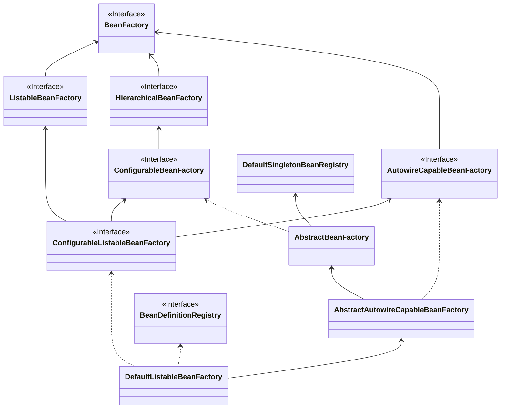

# bean的生命周期 

先给出比较重要的三个

|            | init-method & destroy-method              | @PostConstruct & @PreDestroy    | InitializingBean & DisposableBean |
| ---------- | ----------------------------------------- | ------------------------------- | --------------------------------- |
| 执行顺序   | 最后                                      | 最先                            | 中间                              |
| 组件耦合度 | 无侵入（只在 `<bean>` 和 `@Bean` 中使用） | 与 JSR 规范耦合                 | 与 SpringFramework 耦合           |
| 容器支持   | xml 、注解原生支持                        | 注解原生支持，xml需开启注解驱动 | xml 、注解原生支持                |
| 单实例Bean | √                                         | √                               | √                                 |
| 原型Bean   | 只支持 init-method                        | √                               | √                                 |

# # IOC容器的一些重要类

## BeanFactory的子接口

这是ioc的基础容器，也spring ioc最顶层的类。其下的子接口和类都是为了实现某些额外的特性（层次性，可搜索性，可配置性）

**主要的特性：**

- 基础容器
- 定义了作用域的概念
- 集成环境配置
- 支持多种类的的配置源
- 层次性的设计
- 完整的生命周期控制机制

### HierarchicalBeanFactory【熟悉】 

这个就是实现**层次性**的BeanFactory。

### ListableBeanFactory 【熟悉】

 这个就是实现**可迭代**的特性，即可以查找到容器中的所有bean

**特性：**

- ListableBeanFactory可以列举中容器的前部bean
- ListableBeanFactory只例举当前容器的bean
- 选择性列举：容器中不是所有的bean都能拿到，比如下面的就拿不到
  - `registerSingleton(...)` 手动注册的 Bean  
  - 嵌套 Bean / 抽象 Bean 定义 
  - 父工厂的bean
- ListableBeanFactory 除了getBeanDefinitionCount` 和 `containsBeanDefinition外，其他方法不适合频繁调用

### AutowireCapableBeanFactory【了解】

支持**自动注入**的 BeanFactory

**特点：**

- AutowireCapableBeanFactory可以支持外部Bean的自动装配
- AutowireCapableBeanFactory用于框架集成
- AutowireCapableBeanFactory 不由ApplicationContext实现但可获取：说明了该接口其实一般使用不到
- AutowireCapableBeanFactory可以借助BeanFactoryAware注入

### ConfigurableBeanFactory【熟悉】

从名字来看，这个类具备了 **可配置**的特性

如何理解 **可配置：**

其实就是指设置值，就好比bean会提供set...的方法一样。

**特点：**

- ConfigurableBeanFactory提供可配置的功能，可以进行修改，扩展等。
- ConfigurableBeanFactory不推荐给开发者使用

## BeanFactory的实现类

### AbstractBeanFactory

作为BeanFactory最基础的一个抽象实现，具备了部分功能。

**特点：**

- AbstractBeanFactory作为BeanFactory最终的基础实现：说白了就是BeanFactory下面第一个抽象的实现类
- AbstractBeanFactory对Bean的支持：就是在BeanFactory的基础上扩展了一些另外的功能，比如Bean的别名（`AliasRegistry` 接口），bean定义的的合并（涉及Bean的继承）
- AbstractBeanFactory定义了模板方法：子类要实现的主要模板方法是：getBeanDefinition` 和 `createBean 。比如 DefaultListableBeanFactory` 和 `AbstractAutowireCapableBeanFactory。说白了就是：使用模板方法，父类提供逻辑规范，子类提供具体的实现。

### AbstractAutowireCapableBeanFactory【掌握】

AutowireCapableBeanFactory的具体实现，它可以实现组件的自动装配了。

**特点：**

- 提供Bean的具体实现逻辑
  - 继承了AbstractBeanFactory的抽象类，且实现了createBean()方法，说明具有 **创建Bean**的能力
    - 其实createBean()方法也不是具体实现，而是 doCreateBean()方法，是**protected**方法，子类可以实现。
  - 实现了 AutowireCapableBeanFactory 接口，说明可以 **实现自动注入了**
- AbstractAutowireCapableBeanFactory实现了属性赋值和条件注入：也就是核心功能：**1、Bean的创建 2、属性填充和依赖的自动注入 3、Bean的初始化**这是创建Bean **最核心的三步**
- AbstractAutowireCapableBeanFactory保留了模板方法：AbstractAutowireCapableBeanFactory并没有实现 AbstractAutowireCapableBeanFactory 的全部模板方法，保留了 resolveDependency 方法，这个方法的作用是  **解析Bean的成员中定义的属性依赖关系**
- AbstractAutowireCapableBeanFactory 不负责BeanDefinition的注册：也就是 AbstractAutowireCapableBeanFactory它是不负责 **Bean定义的进入**

### DefaultListableBeanFactory【掌握】

**唯一一个目前使用的BeanFactory落地实现**

**特点：**

- DefaultListableBeanFactory 是BeanFactory的 **最终默认实现**
- DefaultListableBeanFactory会注册Bean的定义信息再创建Bean：DefaultListableBeanFactory实现

目前的关系：

[drawio图](./DefaultListableBeanFactory.drawio)

## ApplicationContext

[TOC]

